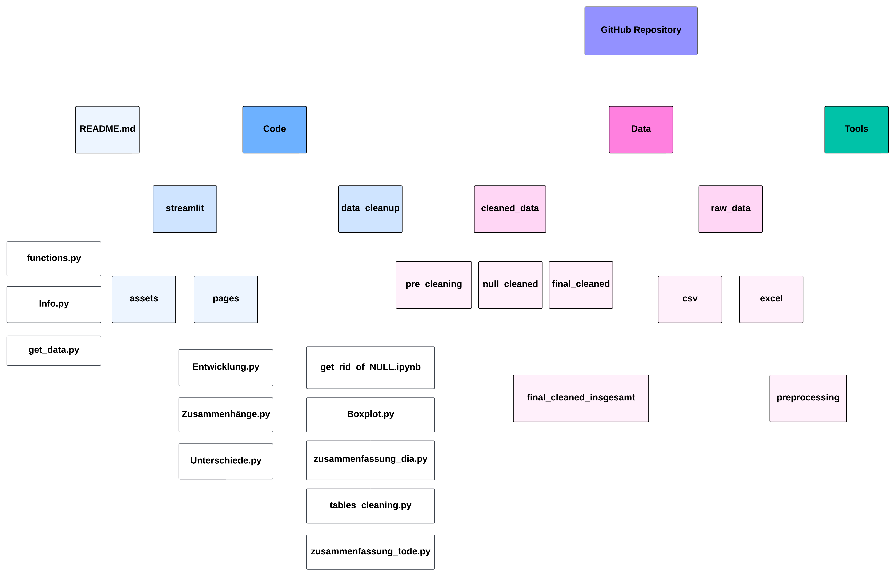

Scope:

Scope: 2010-2024
2010 - 2020 -> Vor-Corona
2020 - 2022 -> Corona
2023 - 2024 -> Nach-Corona

Raw Data(patienten Diagnose / Tode) in mehrere Tabellen je nach Jahren sortiert. 

Die einzelnen Jahrestabellen (Prepcrocessing) wurden auf Abteilungen und insgesamt aggregiert. Die aggregierten Tabellen befinden sich im Ordner Pre-Cleaned. Die nun entstandenen Tabellen werden auf Null Werte geprüft und dabei sind 2 Spalten aufgefallen, die jeweils ohne Daten sind. (15-18 Jahre Weiblich, 28-20 Jahre Weiblich) Diese Spalten werden in jeder Patienten Diagnose Tabelle entfernt um beim zusammenfügen der Altersgruppen ausgeglichen zu sein. Spalten mit weniger fehlenden Werten werden mit dem Durchschnitt aufgefüllt. In der Tabelle 2023 gibt es eine weitere Spalte, welche ohne Daten ist. Diese wird mit durchschnitssDaten der letzten Jahre aufgefüllt. Die verwendeten Programme sind get Rid of Null und zusammenfassen, sowie Tables Cleaning.

In der Tabelle Tode wird die SPalte 75-80 Jahre Weiblich jeweils raudsgenommen, da es keine Daten gibt.

In den Tabellen data_Diagnose.. wurde Zeile 12 Namens Kinderkardiologie , Zeile 14 Kinderchirugie, Zeile 31 Kinder- und Jugendpsychiatrie entfernt, weil offensichtlich falsche Daten sich in den Zeilen befinden.

